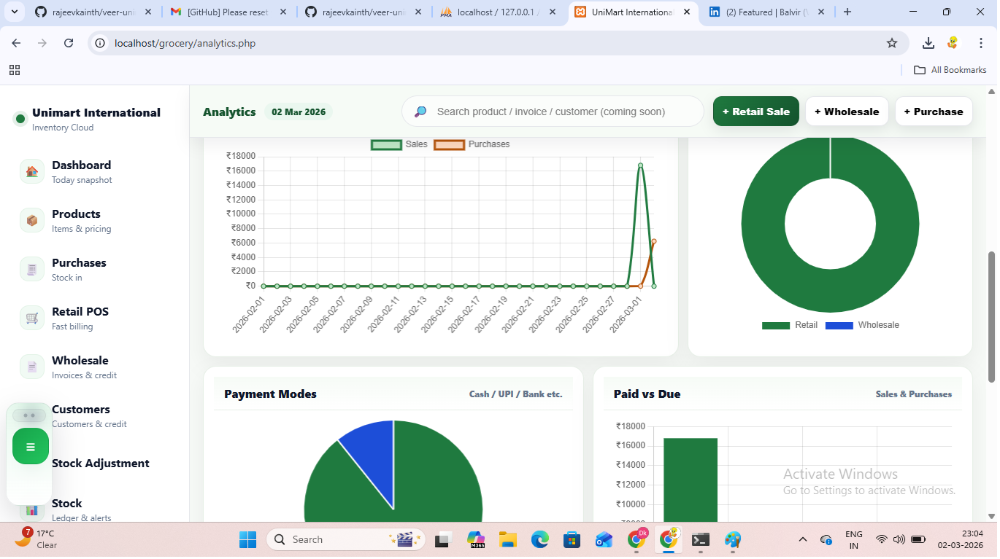
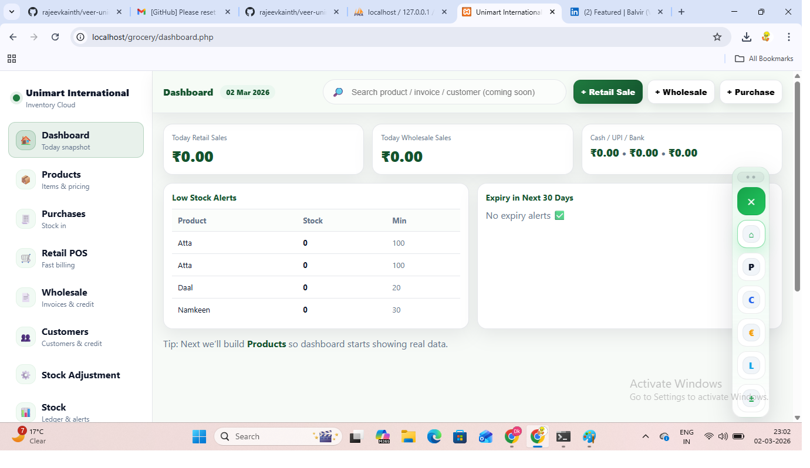
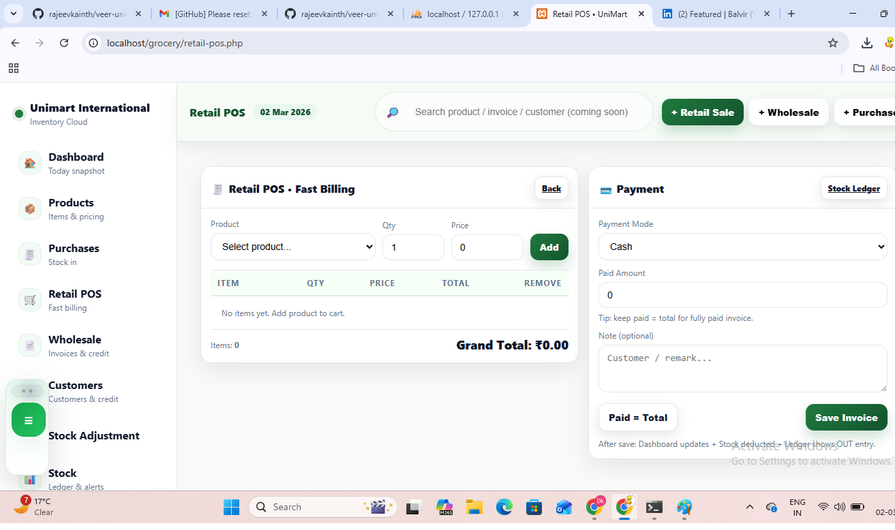

# Veer UniMart – Grocery Inventory & Billing System

A cloud-based Grocery Inventory and Billing System built using PHP and MySQL.  
Designed for retail and wholesale grocery businesses to manage stock, suppliers, purchases, and billing efficiently.

---

## 🚀 Features

- Inventory & Stock Management  
- Supplier & Purchase Tracking  
- Customer Billing & Invoicing  
- Sales Analytics Dashboard  
- Stock Ledger & Adjustments  
- Clean Premium UI  

---

## 📸 Screenshots

(Add your screenshots below after uploading them)

## 📸 Screenshots

### 📊 Analytics Dashboard

  

### 🏠 Dashboard

  

### 🛒 POS Billing

  

## 🛠 Tech Stack

- PHP  
- MySQL  
- HTML  
- CSS  
- JavaScript  

---

## 👨‍💻 Developer

Developed by Veer Kainth  
